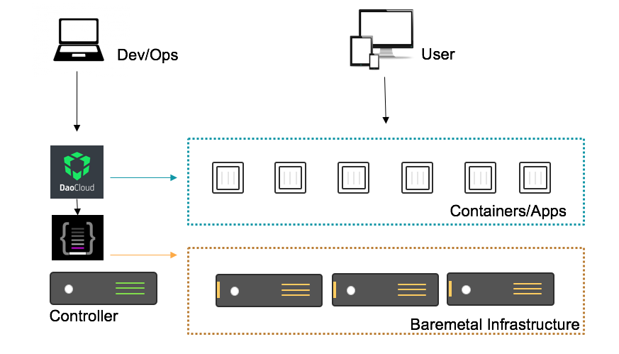
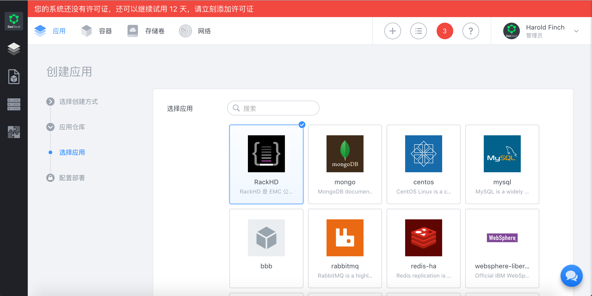
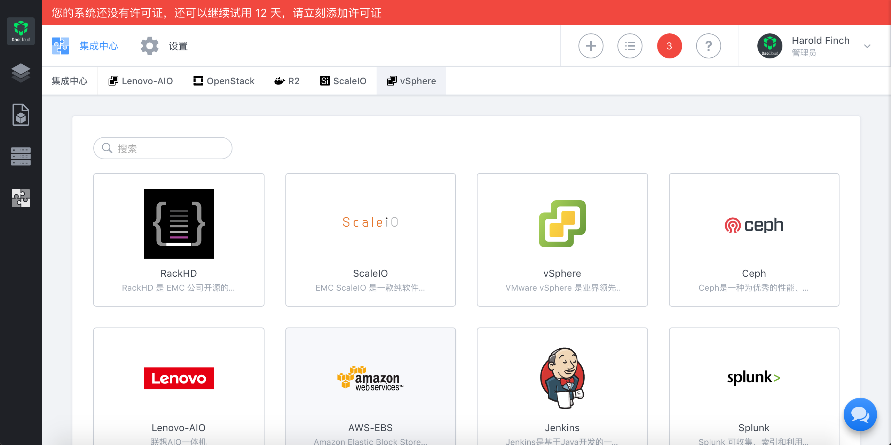
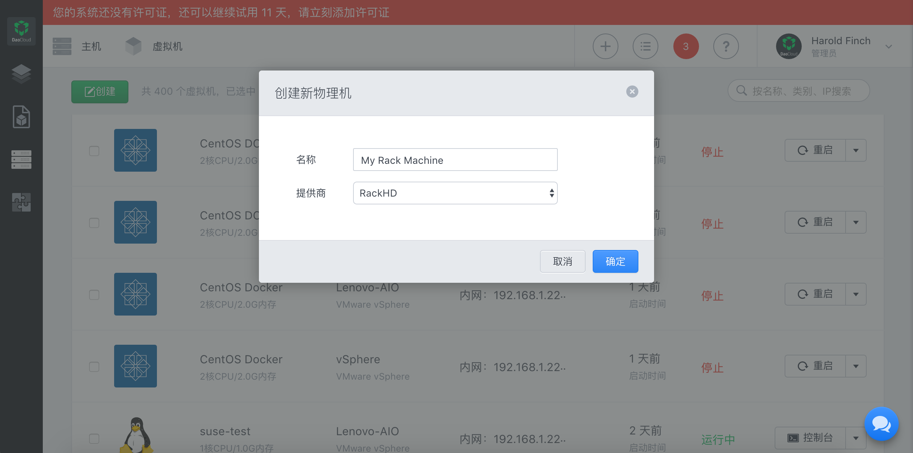
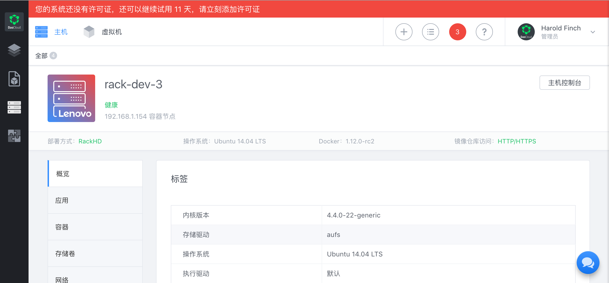

# RackHD

## 介绍

今年西雅图「DockerConf」是历届大会中划时代的一届大会，并不是微软宣布 Windows 平台对 Docker 的支持。而是所有人都清晰的看到了 Docker 正在引领大家迈向的一个未来数据中心的新蓝图，一个我们称为「云原生数据中心」的地方。
大家也都看到了，未来云原生数据中心的新格局，由软件定义的基础架构，容器引擎，和分布式应用组成，这是一种全面的颠覆。他比我们所有人预想的都来的更快，来的更彻底。
在这一颠覆性的新格局里，打造一个真正意义上的软件定义数据中心，成了最为关键的起始条件。请注意，所谓真正的软件定义，就是基础架构除了裸设备的 X86 服务器，什么都没有。是的，没有虚拟化，没有集中存储，没有网络管理员。

DaoCloud | RackHD 的物理容器集群解决方案是针对下一代软件定义数据中心，可以帮助企业打造一个物理资源可扩展的应用持续交付和弹性运行平台。该方案采用以 EMC RackHD 和 DaoCloud Enterprise(以下简称DCE) 为基础，可以做到通过 DCE部署RackHD 集群、 自动扩容物理主机、管理裸金属设备。

## 安装

## 使用

**通过 DCE部署RackHD 集群**

DCE内置定制化企业级应用商店，能够与庞大的 SaaS 及容器化生态对接，实现一键部署式容器化应用，支持常见中间件平台（WebSphere、Tomcat、Jboss、WebLogic等）、日志和监控类（ELK、Splunk、Zabbix）、日常办公（OA、IM、网盘）等。可以把RackHD加入到应用商店中，实现对RackHD的一键部署。
DaoCloud会提供RackHD的Compose文件和镜像。

**自动扩容物理主机**
RackHD支持自动安装主机的功能。DaoCloud会提供一个安装好容器Agent和Docker的操作系统ISO文件。DCE控制器通过调用RackHD的接口，发现物理设备，并安装配置。让这台物理设备能够加入到容器集群中，成为容器集群的一部分。

**管理裸金属设备**

当主机接入到容器集群之后，DCE能够mapping主机和RackHD中主机的关系，并且可以通过RackHD的能力来操作主机，实现开关机，IP-KVM，硬件信息查看等诸多功能。

